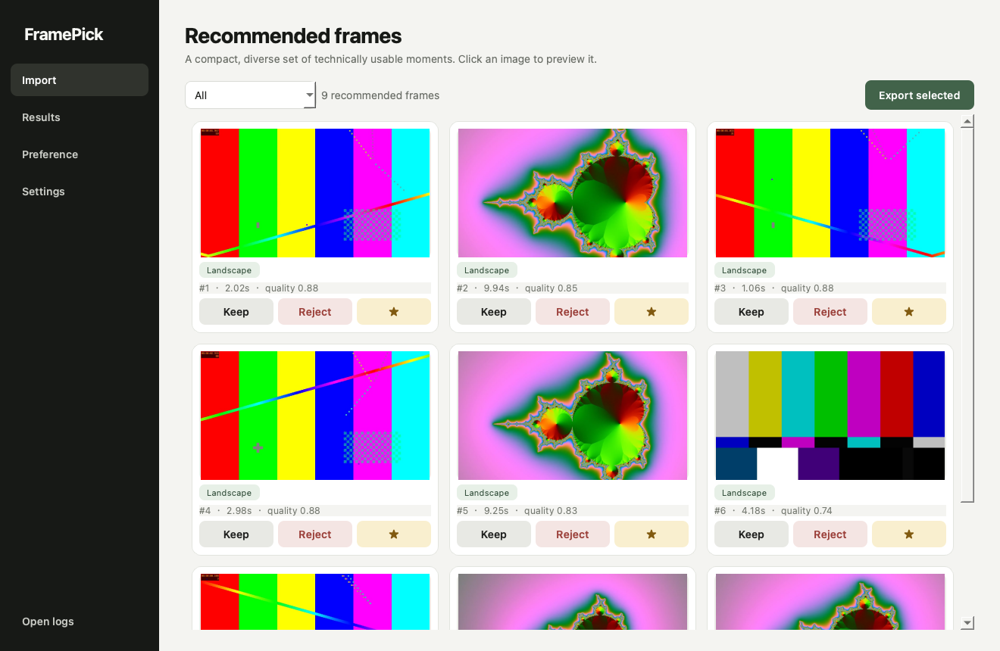

# FramePick Local

FramePick is a local desktop tool that searches video shots for photograph-worthy still frames. It is designed for photographers and content creators: import videos or folders, wait for shot-aware analysis, review a compact grid, mark Keep/Favorite, and export full-resolution PNG or JPEG frames.



## Start on this Mac

The included project has already been installed and tested on the development machine. Double-click **FramePick.app**. If the project is moved to another Mac, run **Install FramePick.command** once first.

## Current workflow

- Drop one video, many videos, or a folder into Import.
- Choose Balanced, Portrait, Action, Landscape, or Product in Settings.
- Analyze. Progress reports the current video, completed shot count, and candidate count.
- Filter Results by People, Action, Landscape, Animal, Product, or Detail.
- Mark frames Keep, Reject, or Favorite. Feedback is saved to a local SQLite database.
- Open Preference to choose A or B between nearby frames from the same shot.
- Export kept/favorite frames as full-resolution PNG or high-quality JPEG.

## Privacy and color

No media or feedback is uploaded. Cache, database, logs, and exports are excluded from Git. Rec.709 is decoded directly by FFmpeg. HDR/BT.2020 inputs are detected and carry a warning in analysis metadata; version 0.1 does not silently apply a homemade grade.

## Developer commands

```bash
.venv/bin/pytest
.venv/bin/framepick-analyze /path/to/video.mov --data-dir work/data
.venv/bin/framepick-evaluate evaluation/private/ground_truth.json
.venv/bin/python scripts/run_synthetic_benchmark.py
```

See [architecture](docs/ARCHITECTURE.md), [testing](docs/TESTING.md), and [ground-truth format](evaluation/README.md).

## Repository policy

This repository intentionally has no license yet. Do not commit personal footage, private ground truth, caches, exported frames, databases, logs, tokens, or API keys.
