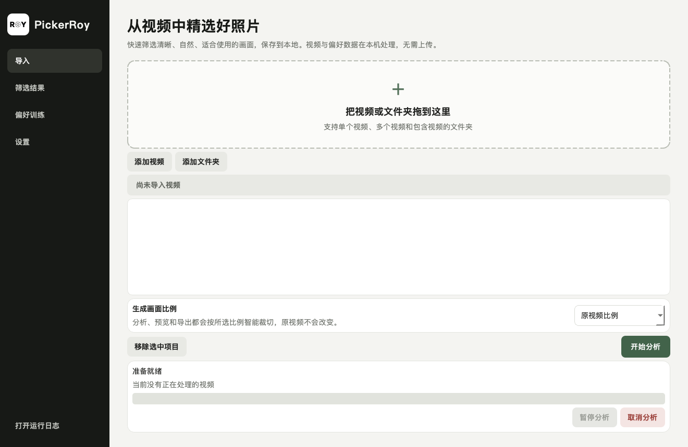

# PickerRoy

## v0.3.5 · 从视频中精选好照片 / Select great photos from video

快速筛选清晰、自然、适合使用的画面，保存到本地。视频与偏好数据在你的设备上处理。/ Quickly shortlist clear, natural, useful frames and save them locally. Video processing and preferences stay on your device.

本版更新镂空 ROY 光圈标志，加入自然的“增强画质”，并修正本机学习样本的更新方式。首次导入会显示简短的素材使用须知。没有宣称新的识别准确率提升。/ This version updates the outlined ROY aperture identity, introduces natural Enhance export, and corrects local preference-sample updates. A short media-use notice appears at first import. No increased recognition accuracy is claimed.

[中英双语更新说明 / Bilingual release notes](docs/RELEASE_NOTES_v0.3.5.md) · [版本下载 / Downloads](https://github.com/kkrouhu/PickerRoy/releases) · [中英双语说明书 / Bilingual manual](docs/manual/PickerRoy中英双语使用说明书.pdf)

同时修复了新 macOS 下 Apple Vision 参数桥接异常导致的识别降级，并让自检记录真实分类后端。/ Also fixes an Apple Vision options-bridging error on newer macOS and records the actual classification backend in smoke-test reports.



PickerRoy 是一款完全在本机运行的视频静帧智能筛选工具，面向摄影师和内容创作者。它不会简单地每隔几秒截图，而是先识别镜头，再结合技术质量、内容类型、社交媒体热门视觉模型和你的本机偏好，挑选清晰、有代表性且彼此不同的瞬间。

App Store V1.0 采用完全免费策略：所有当前核心功能直接可用，不含订阅、App 内购买、付费墙或购买入口。未来商业化计划与早期用户政策均未启用，详见[产品原则](docs/PRODUCT_PRINCIPLES.md)与[商业化计划](docs/MONETIZATION_PLAN.md)。


## 直接使用

普通用户从 GitHub Releases 下载与电脑匹配的 ZIP：Apple 芯片 Mac、Intel Mac 或 Windows x64。解压后直接打开 PickerRoy；独立应用已经包含 Python、视频引擎和热门视觉模型，不需要安装 Codex。

Codex Skill 是另外一个可选下载，只用于让 Codex 更了解 PickerRoy 的安装、使用、测试与排错方式。它不是桌面应用，单独下载 Skill 不能代替 PickerRoy。

首次启动和系统安全提示见[下载、安装与发布说明](docs/DISTRIBUTION.md)。

首次试用、iPhone 免费个人签名，以及何时需要付费会员，见[一步一步免费试用指引 / Free trial guide](docs/FREE_TRIAL_GUIDE_zh-EN.md)。先 Mac App Store（Apple 芯片优先），再 iPhone；当前不开发 iPad、Watch 或 Vision Pro。

完整资料提供[中文 PDF](docs/manual/PickerRoy中文使用说明书.pdf)、[English PDF](docs/manual/PickerRoy-English-User-Manual.pdf)和[中英双语 PDF](docs/manual/PickerRoy中英双语使用说明书.pdf)，同时保留可在线阅读的 Markdown 版本。

## 使用流程

1. 在“导入”页面拖入一个视频、多个视频或包含视频的文件夹。
2. 看到绿色“导入成功”提示后，确认本次新增数量和等待分析总数。
3. 在开始分析前选择生成画面比例：原视频比例、1:1、3:2、2:3、4:3、3:4、16:9 或 9:16。智能裁切只作用于预览和导出，不会改变原视频。
4. 如有需要，在“设置”中选择综合、人像、动作、风景或产品模式。
5. 点击“开始分析”。界面会显示当前视频、镜头进度和候选画面数量；分析中可暂停、继续或取消，也可以把新视频加入下一轮。
6. 在“筛选结果”中按人物、动作、风景、动物、植物、产品/装备或细节/特写筛选。结果卡上的“热门视觉”是当前视频内部的相对热度排名。
7. 把需要的画面标记为“保留”或“收藏”，不需要的标记为“淘汰”。
8. 点击“导出已选画面”，选择 PNG/JPEG，并选择直接导出或“增强画质”。增强保持相同像素尺寸，按画面温和调整明暗与色彩，不统一强锐化。
9. 保留、收藏、淘汰和“偏好训练”A/B 都会形成有效的本机学习对；从下一次分析开始逐步参与排序。

## 已启用的训练能力

- 社交媒体热门视觉：使用 IIPA 在 Instagram 热度图片对上训练的 ResNet-50 模型，本地 ONNX 推理，不联网。
- 个人偏好学习：收藏、保留、淘汰和同镜头 A/B 共同训练轻量级成对排序模型；样本少时影响较轻，最高受约 34% 安全上限约束。
- 主题审美：人物增加脸部/眼部可见度、表情、面部清晰度与曝光、主体位置；风景增加地平线、色彩协调、明暗范围、空间层次与自然色彩线索。
- 内容分层：人物、动作、风景、动物、植物、产品和细节使用不同融合权重；严重模糊、黑屏和过曝始终先被技术过滤。

## 一千个人，一千种本机偏好

**越选，越懂你的眼光。** PickerRoy 在你的设备上学习你的选择，让视频选图逐渐贴近你的拍摄习惯与审美。

**A shortlist that learns your taste.** PickerRoy learns from your decisions on your own device, gradually adapting recommendations to your shooting habits and visual taste.

PickerRoy 不需要用户会编程。用有代表性的素材完成几轮“分析—真实选择—再分析”，有效比较会逐步参与后续排序。收藏是更强的喜欢信号，并选入导出；它不是自动保存照片。仅导入或重复运行而不做选择不等于训练，样本计数不等于准确率，也不保证每次推荐都更准确。普通个性化不需要 Codex；可选 Skill 用于让 Codex 生成隐私摘要、做源码级定向优化、测试与重建。

Real comparable choices—not import counts—inform later rankings. Favorite expresses a stronger preference and selects a frame for export; it does not save the photo automatically. Sample counts are not accuracy, and improvement is not guaranteed on every run.

模型来源、边界和后续数据计划见[训练说明](docs/TRAINING.md)。

## 隐私与颜色

视频、缓存、导出图片和偏好数据都不会上传。缓存、数据库、日志、私有测试素材和导出图片均已排除在 Git 之外。

Rec.709 视频直接通过 FFmpeg 解码。检测到 HDR/BT.2020 时会记录警告；当前版本不会擅自给视频套调色。

请仅使用你有权处理的素材，并自行确认截图及发布所需授权。违法或侵权使用，由使用者依法承担相应责任。PickerRoy 不授予素材使用权，不排除法律规定不得免除的责任。

Use only media you are entitled to process and check the permissions needed to extract and publish images. Users are responsible under applicable law for unlawful or infringing use. PickerRoy does not grant media rights or exclude liability that cannot legally be excluded. [素材与使用须知 / Media and use notice](docs/MATERIAL_USE_NOTICE_zh-EN.md).

## 开发与评测命令

```bash
.venv/bin/pytest
.venv/bin/pickerroy-analyze /视频路径/示例.mov --data-dir work/data
.venv/bin/pickerroy-evaluate evaluation/private/ground_truth.json
.venv/bin/python scripts/run_synthetic_benchmark.py
.venv/bin/python scripts/run_preference_smoke.py /视频路径/示例.mov work/preference-smoke
```

详细资料：[技术架构](docs/ARCHITECTURE.md)、[测试说明](docs/TESTING.md)、[人工标准答案格式](evaluation/README.md)、[首轮调试报告](docs/FIRST_ROUND_REPORT.md)、[第三方许可说明](THIRD_PARTY_NOTICES.md)。

## 仓库规则

当前没有替用户决定开源许可证。不要提交私人视频、私有 Ground Truth、缓存、导出图片、数据库、日志、Token、API Key 或个人路径。
