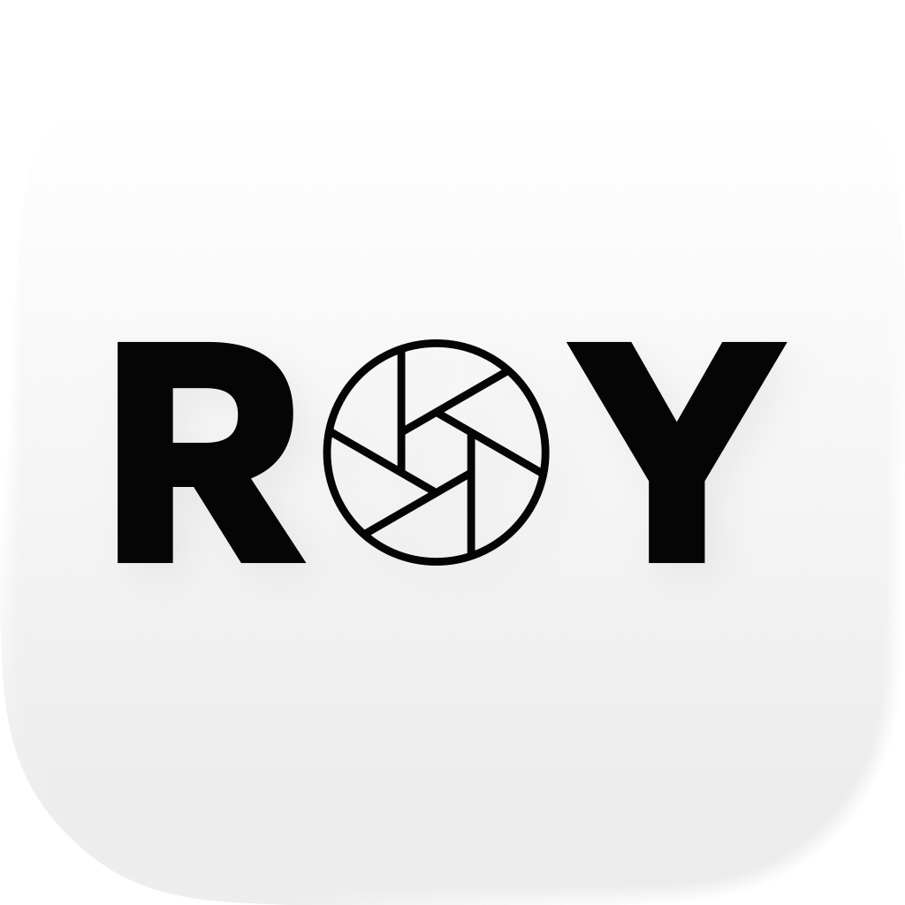
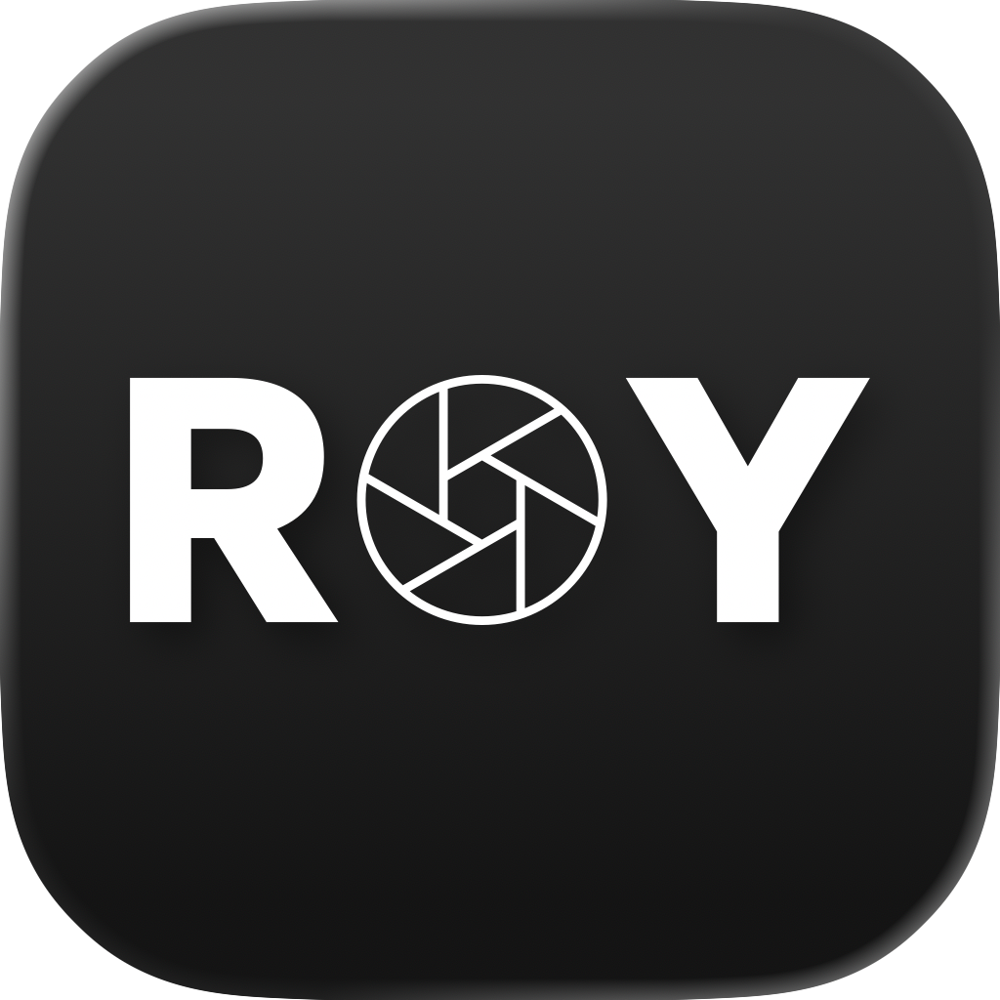
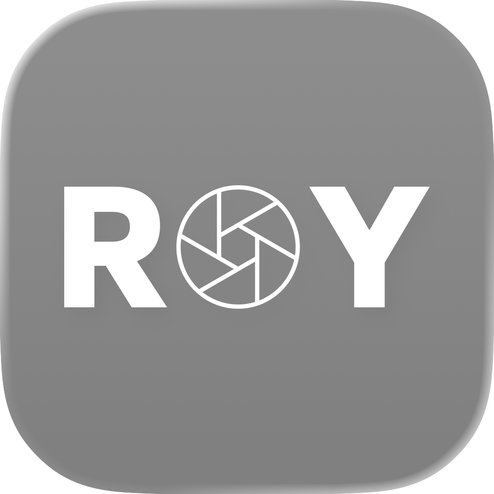
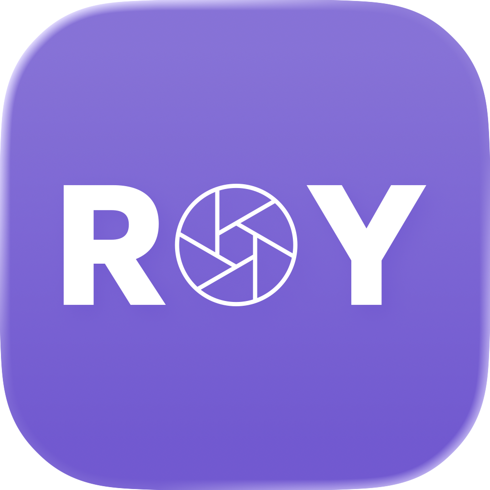
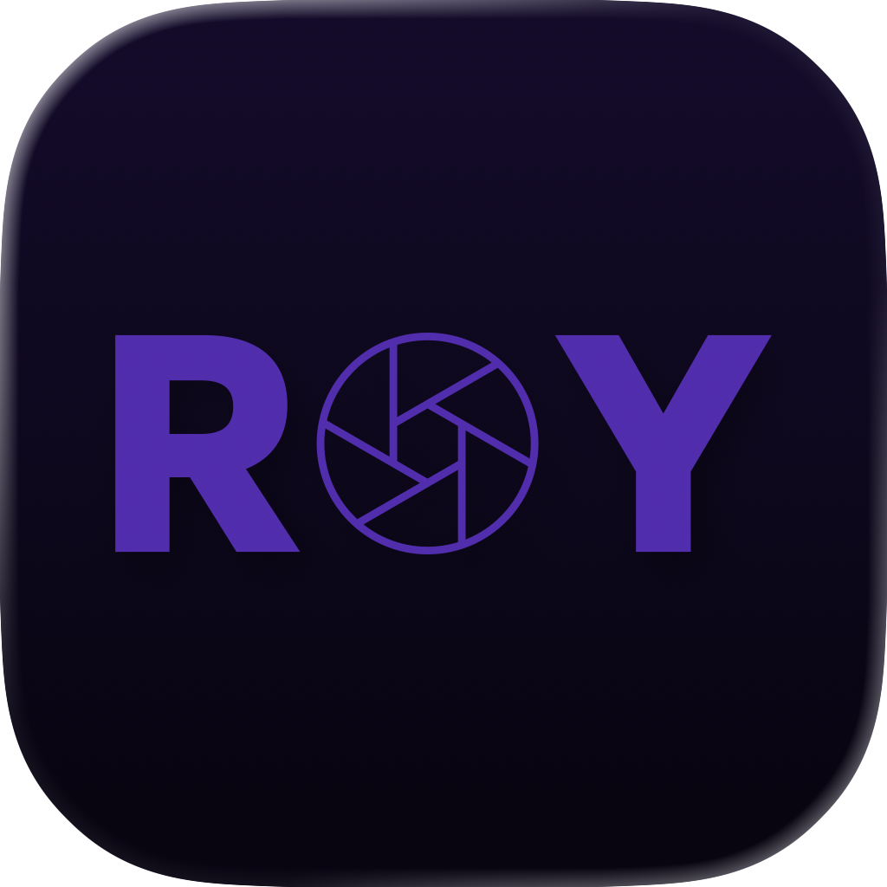

# 系统分层图标预览 / Layered icon previews

2026-09-15 · Apple Icon Composer 27 的官方渲染器，设计代际设为 26，与当前 iPhone 测试方向对应。这里是源图标的实际渲染导出，不是生成式概念图，也不是手机已安装截图。/ Exported by Apple's Icon Composer 27 renderer using design generation 26. These are renders of the source icon, not generative concepts or screenshots of an installed app.

| 默认 / Default | 深色 / Dark | 透明浅色 / Clear light |
| --- | --- | --- |
|  |  |  |
|  |  |  |

| 着色浅色 / Tinted light | 着色深色 / Tinted dark | 透明深色 / Clear dark |
| --- | --- | --- |
|  |  |  |

着色示例使用渲染器默认紫色，不是品牌主色。透明模式显示于渲染器背景，具体壁纸、着色选择和系统设置会影响最终效果。/ Purple is the renderer's example tint, not a new brand color. Clear renditions use the renderer backdrop; actual wallpaper, user tint, and system settings affect the final appearance.

保留 R/Y 轮廓、镂空六片光圈、字标居中。深色/单色单独适配前景，避免图案融入底色。64px 已检查光圈中心及线条可辨；真实设备及更小图标仍需验收。/ R/Y shapes, the outlined six-blade aperture, and centered placement are retained. Separate dark/mono foregrounds prevent the mark disappearing into the enclosure. The aperture and seams were reviewed at 64px; physical devices and smaller contexts still need validation.

尚未包含于 v0.3.4 下载包，没有完成商店提交或审核。/ Not included in v0.3.4 downloads; no App Store submission or approval is implied.

源文件：[AppIcon.icon](../../apple/PickerRoyApple/AppIcon.icon/icon.json)。复现：[brand README](../../scripts/brand/README.md)。/ Source and reproduction links above.
