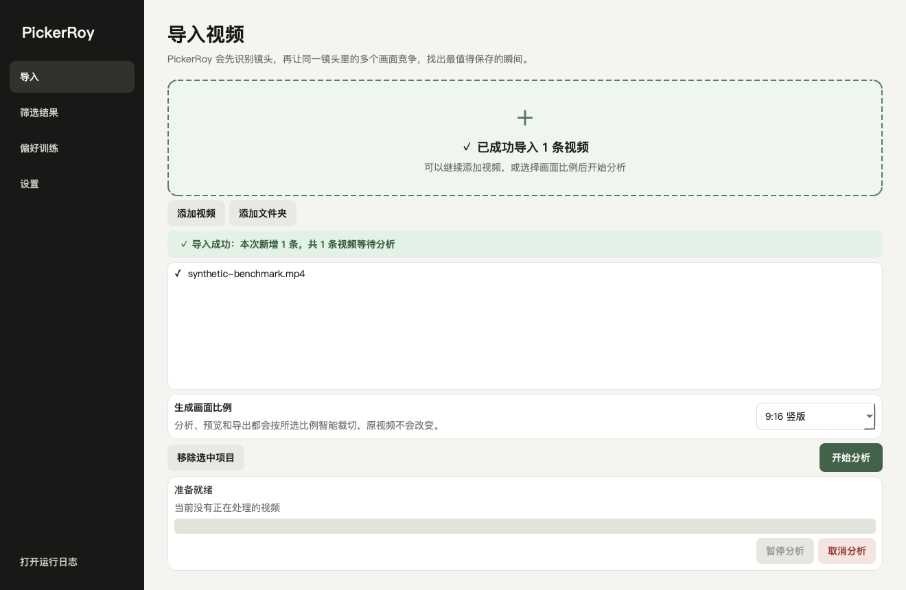
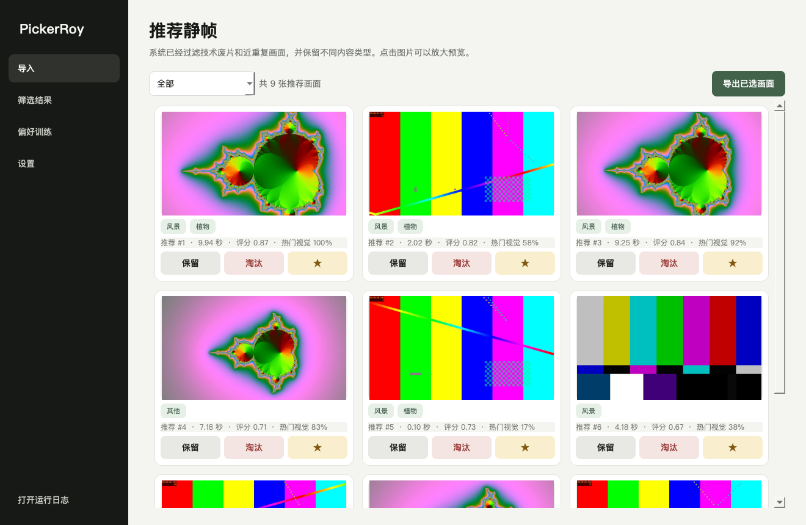
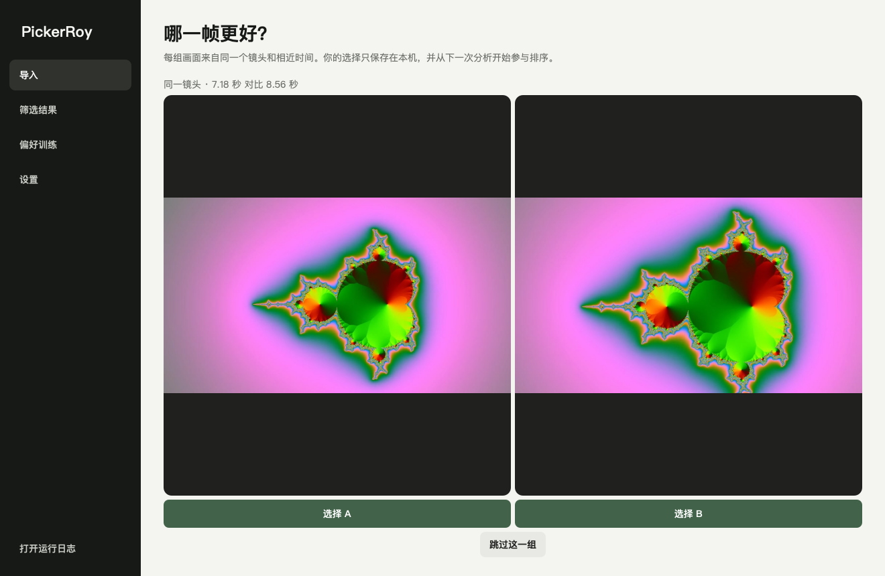

# PickerRoy English User Manual

Version 0.3.1 · macOS and Windows · September 2026

Turn a video into photographs genuinely worth keeping.

PickerRoy is a local-first intelligent video still-frame selector for photographers and creators. It detects shots, lets nearby candidate frames compete, and ranks a smaller, sharper, less repetitive set using technical quality, composition, portrait and landscape cues, an offline social-visual model, and your own local preferences.

Your videos, previews, choices, and exports remain on your computer. The standalone app needs no Codex, Python, separate FFmpeg installation, account, subscription, or internet connection after download.

The Apple App Store V1.0 release is completely free: free download, all current core features available, and no subscription, In-App Purchase, paywall, upgrade button, or restore-purchase control. Its initial two-week observation period never triggers automatic charging or locking. On iPhone and iPad, PickerRoy uses the system file picker for input and requests add-only Photos access only when saving selected results; it does not read the full photo library. Core processing has no network dependency; a physical-device airplane-mode run remains a required pre-release test.

## 1. What is new in 0.3.0

- Pause, resume, or cancel analysis without quitting the app.
- Import more videos during analysis; they remain queued for the next batch.
- Portrait ranking considers face and eye visibility, expression cues, facial focus and exposure, and subject placement.
- Landscape ranking considers horizon placement, color harmony, tonal range, depth layers, and natural-color cues.
- Favorite, Keep, Reject, and A/B choices all become local learning signals.
- A personalization panel shows effective training pairs and preferred directions.
- Export directly or with optional pixel recovery and restrained visual optimization.

PickerRoy does not impose one fixed taste. Outdoor, urban advertising, indoor portrait, product, and travel creators can teach their local copies through real choices. **A thousand users can gradually form a thousand different local preference models.**

## 2. Choose the correct download

| Computer | Release asset |
|---|---|
| Apple Silicon Mac (M1/M2/M3/M4 and later) | `PickerRoy-macOS-Apple-Silicon.zip` |
| Intel Mac | `PickerRoy-macOS-Intel.zip` |
| 64-bit Windows 10/11 | `PickerRoy-Windows-x64.zip` |
| Optional Codex assistance | `PickerRoy-Codex-Skill-v0.3.1.zip` |

The App and the Skill are different. The App is the product an ordinary user opens. The Skill is a compact professional guide that helps Codex install, diagnose, summarize preferences privately, modify source code, test, and rebuild. Normal app use never requires Codex.

## 3. Install and open

### macOS

1. Unzip the correct package and move `PickerRoy.app` to Applications.
2. Open it normally. If macOS blocks the first launch of the non-notarized community build, Control-click the app, choose Open, and confirm.
3. Do not disable Gatekeeper globally.

### Windows

1. Extract the ZIP completely. Do not run from inside the archive.
2. Keep the entire extracted `PickerRoy` folder together; do not move only the EXE.
3. Double-click `PickerRoy.exe`.
4. If SmartScreen appears, verify the official project Release and compare its SHA-256 first.

## 4. Your first selection in three minutes

1. Open Settings and confirm the environment check is green.
2. Return to Import and drag in one video, several videos, or a folder.
3. Confirm the green banner shows successful import, the new count, and the waiting total.
4. Before analysis, choose an output aspect ratio and a Balanced, Portrait, Action, Landscape, or Product emphasis.
5. Start analysis. Pause, resume, or cancel if the clip is long.
6. Open Results, preview frames, and mark them Keep, Favorite, or Reject.
7. Export selected frames as PNG or JPEG, directly or optimized.

## 5. Queue and analysis controls

Supported formats include MP4, MOV, M4V, MKV, AVI, WEBM, MTS, M2TS, and MXF. Importing creates a queue and never modifies the source video.

- Pause suspends analysis and the active decoder; the button changes to Resume.
- Cancel safely stops the current job. Fully completed-video results remain; unfinished videos stay queued.
- Videos added during a run are labeled for the next batch and cannot accidentally inherit already-fixed parameters.
- When the batch ends, choose a new ratio or mode if needed and start the remaining queue.

A platform decoder may take a brief moment to reach a safe pause or stop boundary.

## 6. Aspect ratios and modes

| Choice | Typical use |
|---|---|
| Original | Preserve source composition |
| 1:1 | Square social posts |
| 3:2 / 2:3 | Common camera landscape / portrait |
| 4:3 / 3:4 | Editorial and social images |
| 16:9 / 9:16 | Widescreen cover / vertical mobile content |

The selected crop is used consistently for previews and full-resolution export. Source videos are never altered. Smart cropping combines edge saliency with a conservative center prior, but important commercial frames should still be checked for cropped people, text, and products.

Balanced suits mixed content. Portrait emphasizes faces and human moments. Action emphasizes temporal peaks and motion. Landscape emphasizes horizon, color, and depth. Product emphasizes focus, composition, and detail.

## 7. How frames are ranked

PickerRoy first removes black frames, blank transitions, severe overexposure, severe defocus, and decode failures. Directional motion blur gets limited tolerance in dynamic shots.

Portrait cues include face and eye visibility, expression, facial focus, exposure, and placement near useful center or thirds positions. Landscape cues include horizon thirds, color harmony, restrained saturation, tonal range, depth layers, and natural-color cues.

The bundled IIPA ResNet-50 ONNX model locally estimates intrinsic Instagram-style visual popularity. The percentage is a **relative rank inside the current video**, not a promised like count. Account reach, posting time, caption, audience, and recommendation systems are not inputs.

As valid feedback accumulates, the personal model receives gradually more influence under a 34% safety cap. Technical minimums and diversity remain active so that a few accidental clicks cannot dominate everything.

## 8. Train your own PickerRoy

Begin with 5-10 videos representative of your real work. Outdoor creators can mix portraits, vistas, animals, plants, and details. Commercial, city, indoor, and product creators should use their typical assignments.

- **Favorite** means a frame strongly represents your taste.
- **Keep** means it meets delivery quality even if it is not the hero image.
- **Reject** means you deliberately do not want it despite possible technical adequacy.
- **A/B** provides the cleanest relative preference between nearby moments in one shot.

Repeated analysis without choices is not training. A useful first cycle is 4-5 rounds of analyze, choose, and analyze again. The personalization panel reports videos, effective training pairs, decision counts, and category direction.

## 9. Direct and optimized export

Only Keep and Favorite frames are exported.

Direct export decodes the original video at the selected time, applies the chosen crop, and writes PNG or high-quality JPEG without a creative grade. It is the faithful option for further editing.

Optimized export is useful when a widescreen source is cropped vertically or square. It uses high-quality Lanczos interpolation to recover pixel area toward the source frame, limited to 2x per side and 24 megapixels, followed by restrained local contrast, saturation, and sharpening.

Optimization improves delivery dimensions and presentation. It is not generative super-resolution and cannot reconstruct true detail absent from the source.

## 10. Hardware and speed

PickerRoy primarily uses CPU, memory, and storage. A discrete GPU and fast internet are not required.

| Resource | Recommendation |
|---|---|
| Memory | 8 GB minimum; 16 GB or more for long 4K/high-bitrate footage |
| Storage | Allow roughly 10%-30% of active source-media size for cache and exports |
| GPU | Optional; the main path does not require one |
| Internet | Needed for download only; not analysis, learning, preview, or export |

Long 4K, H.265, high-frame-rate, and shot-dense videos take longer. Test usefulness with a representative 1-3 minute clip before a full batch.

## 11. App, Skill, Agent, and vibe coding

- **App:** the PickerRoy product an ordinary user opens.
- **Skill:** professional instructions that teach Codex how to work reliably with PickerRoy; it is not the app.
- **Agent:** an AI worker that understands context, uses tools, and completes a multi-step objective.
- **Vibe coding:** describing product goals and feedback in natural language while an AI agent implements, tests, and iterates. Product judgment and engineering verification still matter.

Built-in personalization requires no Codex. Codex and the Skill are needed only for deeper source-level diagnosis and redevelopment. The Skill includes a privacy-preserving summary script that emits counts, category preferences, and aggregate features without paths, images, videos, candidate IDs, or timestamps.

## 12. Privacy and backups

PickerRoy uploads none of your videos, previews, exports, logs, or preference database by default. Settings shows the local data location.

- Back up that folder before changing computers if you want to preserve learned preferences.
- Never commit `pickerroy.sqlite3`, caches, private videos, or exports to a public repository.
- For support, share error text or an anonymous preference summary first. Review logs and media before uploading them.
- Reinstalling or updating can retain personalization when the data directory is preserved.

## 13. Troubleshooting

### Start Analysis is disabled

Confirm a supported video was imported and inspect the Settings environment check. Standalone packages normally include the video tools and model.

### Analysis is slow

4K, H.265, high frame rates, long duration, and many cuts increase work. Pause, cancel, or test a shorter representative clip. Speed depends on local CPU and decoding complexity, not internet speed.

### Nothing exports

Mark at least one visible frame Keep or Favorite. The active category filter changes what is visible; switch back to All if necessary.

### HDR color looks unexpected

PickerRoy detects HDR/BT.2020 and records a warning, but 0.3.0 does not apply a creative grade or full HDR-to-SDR pipeline. Inspect PNG output in a color-managed application.

### Recommendations do not match my taste

Confirm mode and ratio, then provide honest Favorite, Keep, Reject, and A/B feedback. If a stable problem remains after representative footage and dozens of effective pairs, install the Skill and ask Codex to create an anonymous profile and perform a targeted source iteration.

## 14. Honest limitations

PickerRoy is an editing assistant, not an aesthetic judge. Social popularity is not artistic value, a detected smile is not always the best expression, and composition rules do not replace intent. Current portrait cues cannot understand every blink, pose, occlusion, or group relationship. Landscape metrics cannot understand every abstract, minimal, or experimental image. The user remains the final editor.

## 15. Release integrity

Every ZIP in GitHub Releases has a matching `.sha256`. Current community packages do not use Roy's own Apple Developer ID or a commercial Windows signing certificate, so the operating system may request first-launch confirmation. This is unrelated to Python or Codex requirements.

PickerRoy makes one practical promise: **show you fewer unusable frames, then let every real decision quietly make the tool more like you.**
