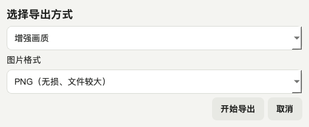
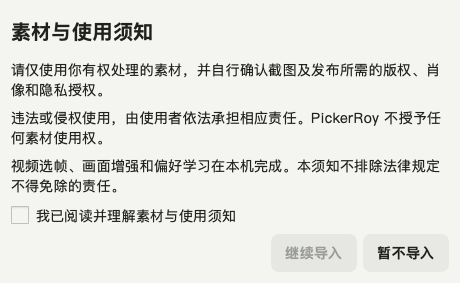

# PickerRoy English User Manual

Version 0.3.5 · macOS and Windows · September 2026

Document status: the local v0.3.5 Apple Silicon Mac test package has passed build, real-image, and launch checks. These features are not in v0.3.4. Other platforms depend on their published assets; App Store and physical-iPhone acceptance remain pending.

Select great photos from video. Quickly shortlist clear, natural, useful frames and save them locally.

New in this version: an outlined ROY aperture identity and redesigned Enhance export. Adjustments respond to each image's contrast, shadows, and color without increasing pixel dimensions or applying sharpening to every frame. This manual explains Favorite and local personalization, including the correction that lets recent decisions enter the training set even after older records accumulate. No increased recognition accuracy or speed is claimed.

v0.3.4 fixed an Apple Vision options-bridging error on newer macOS that could force classification to fall back. Standalone smoke tests record the backend used after analysis. The planned store rollout is Mac App Store first, then iPhone; a GitHub test package does not mean either store release is live. This desktop build uses compatible icon assets; the native Apple target's layered Liquid Glass app icon is a separate build path.

Before upgrading, finish exporting and quit the previous app, then replace the application. Retain the previous installer and local data directory for rollback. This is not an App Store build and is not Developer ID-notarized. Do not disable system protections. Processing videos needs no network connection; downloading the app, system updates, or cloud-stored originals may still require internet access.

PickerRoy is a local-first intelligent video still-frame selector for photographers and creators. It detects shots, lets nearby candidate frames compete, and ranks a smaller, sharper, less repetitive set using technical quality, composition, portrait and landscape cues, an offline social-visual model, and your own local preferences.

Your videos, previews, choices, and exports remain on your computer. The standalone app needs no Codex, Python, separate FFmpeg installation, account, subscription, or internet connection after download.

The planned Apple App Store V1.0 release is free, with all current core features available and no subscription, In-App Purchase, paywall, or purchase controls. Its observation period does not trigger automatic charges or locking. On iPhone, PickerRoy uses the system file picker for input and requests add-only Photos access only when saving results; it does not read the full photo library. Core processing has no network dependency; a physical-device airplane-mode run remains a required pre-release test. iPad, Apple Watch, and Vision Pro are not current targets.

## 1. What PickerRoy can do

- Pause, resume, or cancel analysis without quitting the app.
- Import more videos during analysis; they remain queued for the next batch.
- Portrait ranking considers face and eye visibility, expression cues, facial focus and exposure, and subject placement.
- Landscape ranking considers horizon placement, color harmony, tonal range, depth layers, and natural-color cues.
- Favorite, Keep, Reject, and A/B choices become local learning signals when usable comparisons can be formed.
- A personalization panel shows effective training pairs and preferred directions.
- Export directly or use Enhance for adaptive, restrained tonal and color adjustments at the same pixel dimensions.

A shortlist that learns your taste. PickerRoy learns from your decisions on your own device, gradually adapting video-frame recommendations to your shooting habits and visual taste. It learns a local preference profile, not a new general-purpose AI model. Importing or reanalyzing more videos without making choices does not teach it your preferences.

## 2. Choose the correct download

| Computer | Release asset |
|---|---|
| Apple Silicon Mac (M1/M2/M3/M4 and later) | `PickerRoy-macOS-Apple-Silicon.zip` |
| Intel Mac | `PickerRoy-macOS-Intel.zip` |
| 64-bit Windows 10/11 | `PickerRoy-Windows-x64.zip` |
| Optional Codex assistance | `PickerRoy-Codex-Skill-*.zip` |

The App and the Skill are different. The App is the product an ordinary user opens. The Skill is a compact professional guide that helps Codex install, diagnose, summarize preferences privately, modify source code, test, and rebuild. Normal app use never requires Codex.

## 3. Install and open

### macOS

1. Unzip the correct package and move `PickerRoy.app` to Applications.
2. Open it normally. This community build is not Developer ID-signed or notarized. If the developer cannot be verified, first verify the source and checksum. Only if you trust it, review the app-specific Open Anyway option in System Settings → Privacy & Security. If macOS reports damage or malware, stop and report the exact warning.
3. Do not disable Gatekeeper globally.

### Windows

1. Extract the ZIP completely. Do not run from inside the archive.
2. Keep the entire extracted `PickerRoy` folder together; do not move only the EXE.
3. Double-click `PickerRoy.exe`.
4. If SmartScreen appears, verify the official project Release and compare its SHA-256 first.

## 4. Your first selection in three minutes

1. Open Settings and confirm the environment check is green.
2. Return to Import and drag in one video, several videos, or a folder.
3. Confirm the green banner shows successful import, the new count, and the waiting total.
4. Before analysis, choose an output aspect ratio and a Balanced, Portrait, Action, Landscape, or Product emphasis.
5. Start analysis. Pause, resume, or cancel if the clip is long.
6. Open Results, preview frames, and mark them Keep, Favorite, or Reject.
7. Export selected frames as PNG or JPEG with Direct export or Enhance (the Chinese interface labels the latter “增强画质”).

## 5. Queue and analysis controls

Supported formats include MP4, MOV, M4V, MKV, AVI, WEBM, MTS, M2TS, and MXF. Importing creates a queue and never modifies the source video.

- Pause suspends analysis and the active decoder; the button changes to Resume.
- Cancel safely stops the current job. Fully completed-video results remain; unfinished videos stay queued.
- Videos added during a run are labeled for the next batch and cannot accidentally inherit already-fixed parameters.
- When the batch ends, choose a new ratio or mode if needed and start the remaining queue.

A platform decoder may take a brief moment to reach a safe pause or stop boundary.

## 6. Aspect ratios and modes

| Choice | Typical use |
|---|---|
| Original | Preserve source composition |
| 1:1 | Square social posts |
| 3:2 / 2:3 | Common camera landscape / portrait |
| 4:3 / 3:4 | Editorial and social images |
| 16:9 / 9:16 | Widescreen cover / vertical mobile content |

The selected crop is used consistently for previews and full-resolution export. Source videos are never altered. Smart cropping combines edge saliency with a conservative center prior, but important commercial frames should still be checked for cropped people, text, and products.

Balanced suits mixed content. Portrait emphasizes faces and human moments. Action emphasizes temporal peaks and motion. Landscape emphasizes horizon, color, and depth. Product emphasizes focus, composition, and detail.

## 7. How frames are ranked

PickerRoy first removes black frames, blank transitions, severe overexposure, severe defocus, and decode failures. Directional motion blur gets limited tolerance in dynamic shots.

Portrait cues include face and eye visibility, expression, facial focus, exposure, and placement near useful center or thirds positions. Landscape cues include horizon thirds, color harmony, restrained saturation, tonal range, depth layers, and natural-color cues.

The bundled IIPA ResNet-50 ONNX model locally estimates intrinsic Instagram-style visual popularity. The percentage is a **relative rank inside the current video**, not a promised like count. Account reach, posting time, caption, audience, and recommendation systems are not inputs.

As valid feedback accumulates, the personal model receives gradually more influence under a 34% safety cap. Technical minimums and diversity remain active so that a few accidental clicks cannot dominate everything.

## 8. Train your own PickerRoy

Begin with 5-10 videos representative of your real work. Outdoor creators can mix portraits, vistas, animals, plants, and details. Commercial, city, indoor, and product creators should use their typical assignments.

- **Favorite** means a frame strongly represents your taste. It joins the export selection and records a stronger preference than Keep.
- **Keep** means you want to export the frame, even if it is not your favorite.
- **Reject** means you deliberately do not want it. It is excluded from the export selection without deleting the source or previously exported files.
- **A/B** provides the cleanest relative preference between nearby moments in one shot.

Favorite distinguishes “usable” from “especially my kind of image.” For two deliverable frames in one video, marking one Keep and the other Favorite tells the local model which measured visual features you prefer.

The desktop app learns relative preferences: Favorite above Keep, and Keep above Reject. Some unmarked candidates from the same shot can also provide comparison partners. Only usable comparison pairs influence a later analysis; an isolated Favorite with no comparable candidate need not create a new pair. It does not instantly reorder the current results.

Favorite saves a local decision, not an image file. It is not cloud synchronization or a separate permanent photo library. Choose Export Selected Frames to create images for other apps, and back up the exported images as well as any preference data you want to keep.

Repeated analysis without choices is not training. A useful first cycle is 4-5 rounds of analyze, choose, and analyze again. The desktop version trains a regularized Bradley–Terry ranking model from the measured features of comparable candidates; it does not retrain the face detector or a general-purpose model. Outdoor, portrait, and landscape are examples of use, not claims that PickerRoy recognizes your profession or understands every creative intention.

The personalization panel describes accumulated examples and choices, not recognition accuracy. More usable examples can give the personal model greater influence, within a 34% cap; no particular example count guarantees it has learned your taste. New feedback affects subsequent analyses. Judge usefulness against your own footage rather than expecting every new result to improve.

In v0.3.5, recent usable decisions enter a bounded sample, alternating across videos and feedback types so older records do not crowd out new choices. Reversing the same A/B keeps the latest choice; cleared labels no longer become inferred neutral choices. History is retained; the 800-pair training cap is not a database-size cap. Time- and crop-specific candidate identities prevent changed sampling from attaching an old decision to a different frame. Old learning records remain, but old card labels are not guessed onto newly generated candidates.

## 9. Direct export and Enhance

Only visible Keep and Favorite frames are exported. If a category filter is active, switch to All before exporting selections across every category.

### Direct export: preserve the original look

The existing option is unchanged. Direct export decodes the original video at the selected time, applies the chosen crop, and writes PNG or high-quality JPEG without the additional Enhance adjustments. Choose it for archiving, your own grading, or preserving an intentional original look. A still is decoded and encoded again; this is not a bit-for-bit copy of the compressed video data.

### Enhance: a more considered finish

Enhance is a key PickerRoy feature for improving the presentation of suitable frames, not for increasing resolution or making every image look sharper. The Chinese interface uses only the label “增强画质”; this manual carries the explanation.

- When an image looks flat, it gently increases contrast while leaving room at the darkest and lightest ends.
- When usable tonal information exists in the shadows, it makes restrained shadow adjustments rather than inventing detail in pure black.
- When colors are muted, it adds modest saturation; already vivid colors receive little or no adjustment, with restraint around warm skin tones.
- Only suitable images receive a small amount of sharpening. Noisy, severely defocused, or already sharp images are not forcibly sharpened.

With the same crop, both modes retain the same output pixel width and height. Enhance no longer enlarges cropped images through interpolation. It is not generative repair or super-resolution and cannot reconstruct missing hair, skin, text, or focus detail. We describe enhancement, not increased clarity or resolution.

Enhance adds analysis and processing, so it generally takes longer than Direct export. Time depends on image count, pixel dimensions, and the computer. The visible change depends on the source too: an image that already has suitable contrast and color may change very little. No mode can guarantee every picture will look better. For important images, export both and choose under the same viewing conditions.

### Compare fairly

Compare the same frame, crop, and pixel dimensions. First assess overall tone and color, then inspect faces, fine lines, and shadows at 100%. Look for a natural presentation, not simply more brightness, saturation, or sharpness. A selected example shows that frame's result, not a promised outcome for every video.

Enhance operates on images produced by the existing export pipeline; it is not a full HDR reconstruction or HDR-to-SDR grading workflow. For HDR, Log, or intentionally low-contrast footage, retain Direct exports and inspect them in a color-managed editor.

## 10. Hardware and speed

PickerRoy primarily uses CPU, memory, and storage. A discrete GPU and fast internet are not required.

| Resource | Recommendation |
|---|---|
| Memory | 8 GB minimum; 16 GB or more for long 4K/high-bitrate footage |
| Storage | Allow roughly 10%-30% of active source-media size for cache and exports |
| GPU | Optional; the main path does not require one |
| Internet | Needed for download only; not analysis, learning, preview, or export |

Long 4K, H.265, high-frame-rate, and shot-dense videos take longer. Test usefulness with a representative 1-3 minute clip before a full batch.

## 11. App, Skill, Agent, and vibe coding

- **App:** the PickerRoy product an ordinary user opens.
- **Skill:** professional instructions that teach Codex how to work reliably with PickerRoy; it is not the app.
- **Agent:** an AI worker that understands context, uses tools, and completes a multi-step objective.
- **Vibe coding:** describing product goals and feedback in natural language while an AI agent implements, tests, and iterates. Product judgment and engineering verification still matter.

Built-in personalization requires no Codex. Codex and the Skill are needed only for deeper source-level diagnosis and redevelopment. The Skill includes a privacy-preserving summary script that emits counts, category preferences, and aggregate features without paths, images, videos, candidate IDs, or timestamps.

## 12. Privacy and backups

### Media rights

Use only media you are entitled to process, and confirm any permissions required to extract or publish stills. Users bear responsibility for unlawful or infringing use as applicable under law. PickerRoy does not grant rights to any media or exclude liability that cannot legally be excluded.

The first import shows a notice with an initially unchecked box. Read and check it to continue; cancellation does not import media. Reopen it from Settings. Only the notice version and acknowledgment time are stored on your device, not sent to us. Acknowledgment does not verify copyright ownership. Command-line and developer interfaces do not show this graphical confirmation.

PickerRoy uploads none of your videos, previews, exports, logs, or preference database by default. Settings shows the local data location.

- Back up that folder before changing computers if you want to preserve learned preferences.
- Never commit `pickerroy.sqlite3`, caches, private videos, or exports to a public repository.
- For support, share error text or an anonymous preference summary first. Review logs and media before uploading them.
- Reinstalling or updating can retain personalization when the data directory is preserved.

## 13. Troubleshooting

### Start Analysis is disabled

Confirm a supported video was imported and inspect the Settings environment check. Standalone packages normally include the video tools and model.

### Analysis is slow

4K, H.265, high frame rates, long duration, and many cuts increase work. Pause, cancel, or test a shorter representative clip. Speed depends on local CPU and decoding complexity, not internet speed.

### Nothing exports

Mark at least one visible frame Keep or Favorite. The active category filter changes what is visible; switch back to All if necessary.

### I chose Favorite. Where is the photo?

Favorite records a local preference without writing an image file. Choose Export Selected Frames, select a folder, and finish the export. It does not provide cloud sync or a separate permanent photo library.

### Why does Enhance make little difference?

It does not add fixed contrast, saturation, and sharpening to every image. Suitable originals, noisy frames, or images with too little usable signal receive less processing or remain unchanged. Pixel dimensions stay the same; severe defocus cannot be repaired by this feature. A better moment from the video may be the better answer.

### HDR color looks unexpected

PickerRoy detects HDR/BT.2020 and records a warning, but 0.3.0 does not apply a creative grade or full HDR-to-SDR pipeline. Inspect PNG output in a color-managed application.

### Recommendations do not match my taste

Confirm mode and ratio, then provide honest Favorite, Keep, Reject, and A/B feedback. If a stable problem remains after representative footage and dozens of effective pairs, install the Skill and ask Codex to create an anonymous profile and perform a targeted source iteration.

## 14. Honest limitations

PickerRoy is an editing assistant, not an aesthetic judge. Social popularity is not artistic value, a detected smile is not always the best expression, and composition rules do not replace intent. Current portrait cues cannot understand every blink, pose, occlusion, or group relationship. Landscape metrics cannot understand every abstract, minimal, or experimental image. The user remains the final editor.

## 15. Release integrity

v0.3.5 passed 87 desktop automated tests. The Apple Silicon Mac standalone package passed analysis, Direct PNG and Enhance JPEG export, actual launch, icon-hash, and ad-hoc signature checks, using Apple Vision. First-import notice defaults, cancellation, and read-only access were checked in the actual package. Native Mac/iPhone unsigned builds and engineering regressions passed; physical-device and App Store acceptance remain pending.

Six real outdoor frames were exported in both modes at identical 3840 × 2880 dimensions and crops, with no sharpening. Direct export took about 0.60–0.72 seconds and Enhance about 2.04–2.23 seconds per image on this device for this sample. The full illustrated appendix is local-only pending public-media permission; it is not included in the public repository. Desktop output is not proof of pixel-equivalent native Apple output. Repeated desktop exports now receive numbered filenames instead of replacing existing files.

Every ZIP in GitHub Releases has a matching `.sha256`. Current community packages do not use Roy's own Apple Developer ID or a commercial Windows signing certificate, so the operating system may request first-launch confirmation. This is unrelated to Python or Codex requirements.

**Start with a focused shortlist, then shape future recommendations through your own choices.**
