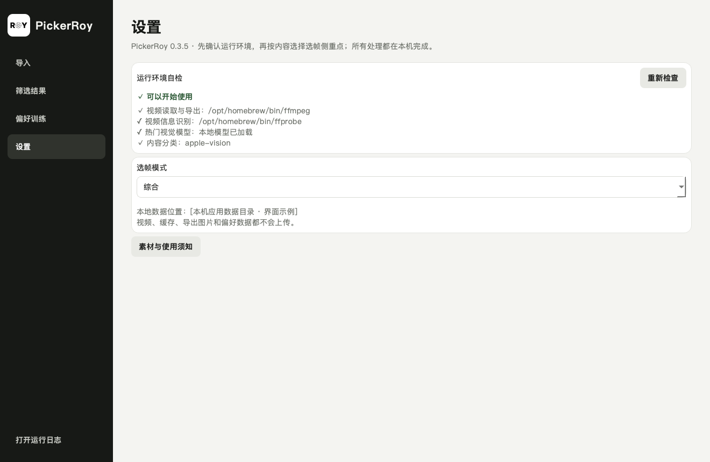

# PickerRoy 中文使用说明书

版本 0.3.5 · Mac 与 Windows · 2026 年 9 月

文档状态：v0.3.5 本地 Mac 测试版已完成构建、实图对比和运行验证；新功能不在 v0.3.4 中。其他系统以对应发布资产为准；App Store 与 iPhone 真机验收尚未完成。

从视频中精选好照片。快速筛选清晰、自然、适合使用的画面，保存到本地。

本版重点：新的镂空 ROY 光圈标志，以及重新设计的“增强画质”导出。增强依据每张画面的状态，克制地调整对比、暗部层次和色彩，不放大图片，不把锐化当成所有画面的统一答案。说明书也补充了“收藏”和本机个性化的实际用途与限制，并修正旧学习记录积累后新选择难以进入样本的问题；不宣称本版提升了识别准确率或速度。

v0.3.4 已修复较新 macOS 上 Apple Vision 参数桥接异常导致的分类降级；独立包自检记录分析后实际使用的分类后端。上架顺序为 Mac App Store 优先，iPhone 随后；GitHub 测试包不代表商店版已上线。桌面测试包使用兼容图标，Apple 原生版的系统 Liquid Glass 分层图标属于另一条构建路径，不应混为一谈。

升级前先完成导出并退出旧版，再用新版替换应用程序；保留旧安装包和本地数据目录即可方便回退。此安装包不是 App Store 版本，尚无 Developer ID 公证。不要关闭系统安全保护。应用处理视频不需要联网，但下载安装包、系统更新或下载云盘原件仍可能需要网络。

PickerRoy 是一款完全在本机运行的视频静帧筛选工具。它会先识别镜头，再让同一镜头里的多个画面竞争，过滤明显废片和近重复画面，最后结合技术质量、内容类型、热门视觉模型和你的个人偏好，给出可继续人工挑选的推荐静帧。

这不是“每隔几秒截一张图”的批量截图器，也不会承诺某张图一定获得多少点赞。它的定位是把最耗时的第一轮海选缩短，让你保留最终编辑权。

越选，越懂你的眼光。PickerRoy 在你的设备上学习你的选择，让视频选图逐渐贴近你的拍摄习惯与审美。收藏、保留、淘汰和 A/B 选择在形成有效比较后，成为本机学习信号；这不是重新训练通用大模型，也不是导入或重复分析次数越多就自动更聪明。

Apple App Store V1.0 采用完全免费策略：免费下载，所有当前核心功能免费使用，不包含订阅、App 内购买、付费墙、升级按钮或恢复购买入口。约两周的公开观察期不会触发自动收费或自动锁定；未来商业化必须经过新的版本更新和明确确认。

在 iPhone 上，视频通过系统文件选择器导入；导出时 PickerRoy 只申请“添加照片”权限，把所选结果写入系统相册，不读取整个图库。视频分析、个性化与图片生成没有网络依赖；真机飞行模式完整流程仍是正式上架前的必测项。当前不开发 iPad、Apple Watch 或 Vision Pro 版本。

## 一、先下载正确的文件

普通用户只需要桌面应用，不需要 Codex，也不需要安装 Python、FFmpeg 或其他开发工具。

| 你的电脑 | 下载文件 |
|---|---|
| Apple 芯片 Mac，包含 M1/M2/M3/M4 及后续 | `PickerRoy-macOS-Apple-Silicon.zip` |
| 较早的 Intel Mac | `PickerRoy-macOS-Intel.zip` |
| 64 位 Windows 10/11 | `PickerRoy-Windows-x64.zip` |
| 想让 Codex 帮助安装和排错 | 可选下载 `PickerRoy-Codex-Skill-*.zip` |

### App 与 Skill 的区别

- PickerRoy App：真正处理视频的软件。下载、解压、打开即可使用，不依赖 Codex。
- PickerRoy Codex Skill：一小组给 Codex 阅读的说明，让 Codex知道如何安装、解释、测试和排查 PickerRoy。它本身不处理视频，使用它需要 Codex 或兼容的智能代理。

## 二、安装与首次打开

### macOS

1. 下载与芯片匹配的 ZIP 并解压。
2. 把 `PickerRoy.app` 拖到“应用程序”文件夹。
3. 双击打开。
4. 当前社区构建未使用 Developer ID 签名和 Apple 公证。若提示无法验证开发者，先核验来源与校验和；确认可信后，按系统提示到“系统设置 → 隐私与安全性”查看本应用的“仍要打开”。若提示损坏、恶意软件或仍不能打开，请停止并反馈，不要关闭 Gatekeeper 或运行网上的解除隔离命令。参见 [Apple 安全打开应用说明](https://support.apple.com/en-us/102445)。

### Windows

1. 下载 `PickerRoy-Windows-x64.zip`。
2. 右键选择“全部解压”。不要直接在 ZIP 预览窗口里运行。
3. 保留完整的 `PickerRoy` 文件夹，双击其中的 `PickerRoy.exe`。不能只把 EXE 单独移动出来，因为同目录包含运行库、视频引擎和模型。
4. 当前社区构建没有 Windows 代码签名证书。若 SmartScreen 提示，请先确认文件来自本项目 GitHub Release，并核对同名 `.sha256` 文件，再决定运行。

## 三、第一次启动先看“运行环境自检”

打开左侧“设置”，顶部应显示绿色“✓ 可以开始使用”。

自检包含四项：

- 视频读取与导出：FFmpeg 是否可以使用。
- 视频信息识别：FFprobe 是否可以使用。
- 热门视觉模型：本地 IIPA ONNX 模型是否存在。
- 内容分类：Mac 优先使用 Apple Vision，其他环境或不可用时自动使用 OpenCV 本地后备方案。

前两项是分析视频的必要条件；发布包已经内置。热门视觉模型缺失时仍可基础排序，但建议重新下载完整发布包。

设置页还可以选择选帧模式：

| 模式 | 更适合 | 变化 |
|---|---|---|
| 综合 | 日常、旅行、混合题材 | 均衡技术、构图、内容和热度 |
| 人像 | 访谈、人像、人物 Vlog | 提高人物与面部质量权重 |
| 动作 | 运动、舞蹈、宠物运动 | 更密集采样并提高动作峰值权重 |
| 风景 | 旅行、自然、城市景观 | 提高风景、植物、构图与层次权重 |
| 产品 | 商品、器材、美食、静物 | 提高细节、清晰度和主体呈现权重 |

## 四、导入视频

你可以把单个视频、多个视频或包含视频的文件夹拖进导入区域，也可以点击“添加视频”或“添加文件夹”。

导入成功后，界面会同时显示：

- 本次新增了几条视频；
- 当前总共有几条视频等待分析；
- 每条视频的文件名；
- 绿色成功状态。

重复添加同一个文件不会重复计数。支持 MP4、MOV、M4V、MKV、AVI、WEBM、MTS、M2TS 和 MXF。

如果没有出现绿色提示，先检查文件扩展名，再到“设置”查看运行环境自检。

## 五、在分析前选择生成画面比例

画幅必须在点击“开始分析”前选择。可选：

| 比例 | 常见用途 |
|---|---|
| 原视频比例 | 保持拍摄画幅，适合归档 |
| 1:1 | 方形社交媒体帖子、头像素材 |
| 3:2 / 2:3 | 相机常见横版或竖版照片 |
| 4:3 / 3:4 | 图文平台、横版讲解图或竖版视觉 |
| 16:9 | 横版视频封面、YouTube、显示器 |
| 9:16 | Reels、Shorts、抖音、小红书竖版封面 |

PickerRoy 使用边缘显著性中心加保守中心先验计算裁切位置，尽量把视觉主体留在画面中。预览与最终导出使用同一个裁切框；原视频不会被改写。

极端横转竖或竖转横会裁掉较多内容。遇到多人站在画面两侧、字幕贴边或主体刻意偏离中心时，应在大图预览中人工确认。

## 六、开始分析时发生了什么

点击“开始分析”后，进度区会显示当前视频、文件序号、镜头进度和候选画面数量。处理顺序如下：

1. 读取视频尺寸、帧率、编码、时长与色彩信息。
2. 识别镜头切换，避免把完全不同的段落混在一起竞争。
3. 根据镜头长度与运动量动态抽取多个候选时刻。
4. 按所选比例生成候选预览与裁切框。
5. 过滤严重黑屏、过曝、虚焦、转场空白等技术失败。
6. 识别人、动作、风景、动物、植物、产品和细节。
7. 评估清晰度、曝光、对比、视觉平衡、三分构图、运动与时序峰值；人物另外考虑脸部/眼部可见度、表情、面部清晰度与曝光、主体位置，风景另外考虑地平线、色彩协调、明暗范围、空间层次与自然色彩线索。
8. 用本地热门视觉模型给有效候选排序。
9. 若已有 A/B 选择，加入个人偏好分。
10. 去除近重复画面并保持镜头和内容多样性。

分析完成后，导入页会显示完成摘要，并自动进入“筛选结果”。

### 暂停、继续、取消与下一轮队列

- 点击“暂停分析”会暂停当前分析和视频解码；按钮随后变成“继续分析”。
- 点击“取消分析”会安全终止任务。已经完整分析的视频结果会保留，未完成视频仍在列表中。
- 当前分析期间仍可继续导入素材；界面会明确显示“已加入下一轮”，当前批次结束后可重新选择画幅和模式再开始。
- 在少数系统视频解码阶段，暂停或取消可能需要短暂等待才能到达安全边界。

## 七、阅读与筛选推荐结果

每张卡片会显示：

- 推荐序号：综合排序位置。
- 时间点：静帧在原视频中的秒数。
- 评分：技术、构图、内容、热门视觉和个人偏好融合后的 0–1 分。
- 热门视觉：当前视频有效候选之间的相对百分位，不是预计点赞数。
- 内容标签：人物、动作、风景、动物、植物、产品/装备、细节/特写或其他。

点击图片可放大。顶部下拉菜单可按类别过滤。

三个操作按钮的含义：

| 操作 | 你表达的意思 | 实际作用 |
|---|---|---|
| 保留 | 这张可用，我想导出 | 加入本次导出选择 |
| ★ 收藏 | 这张尤其符合我的审美 | 同样加入导出选择，并记录比普通保留更强的偏好 |
| 淘汰 | 这张我明确不想要 | 不加入导出选择，并记录负向偏好；不删除原视频或已导出的文件 |

收藏的价值是区分“可用”和“特别喜欢”。例如，同一段视频里有两张都能交付的照片，你可以把一张设为保留、另一张设为收藏，让本机偏好模型知道你更倾向于后一张的画面特征。

这些决定保存在本机数据库里，学习的是相对偏好：收藏高于保留，保留高于淘汰；系统也会在同一镜头中使用部分未标记候选形成比较。只有形成可比较的有效学习对，才会参与后续分析的个人排序。单独收藏一张、又没有可比较候选时，不保证产生新的学习对，也不会立即重排当前结果。可在“偏好训练”页查看有效学习对数量。

收藏不是“已经保存到文件夹”，不是云端同步，也不是独立的永久照片图库。要得到可以在其他软件里打开的图片，仍须点击“导出已选画面”。备份本机数据可以保留偏好标记，但不能替代导出与备份照片。

## 八、导出静帧

1. 至少把一张推荐图标记为“保留”或“收藏”。
2. 点击右上角“导出已选画面”。
3. 选择目标文件夹。
4. 选择 PNG 或 JPEG，并选择“直接导出”或“增强画质”。

PNG 适合后续精修与反复处理；JPEG 更小，适合快速分享。导出会回到原视频的对应时间点重新生成，不是把界面缩略图放大，所以使用原视频分辨率，并应用分析时确定的裁切框。

导出只包含当前类别筛选中可见、已标记为保留或收藏的画面。如需导出所有类别的选择，先把类别切回“全部”。文件名包含原视频名、毫秒时间点与候选标识，方便回到剪辑软件定位。同名文件自动加 _2、_3 等编号，不覆盖已有导出。

### 直接导出：保留原画表现

保持原有选项与处理方式：重新解码原视频的对应画面、应用已经选择的裁切，不额外增加“增强画质”的调整。适合归档、后续自己调色，或保留原片的创作意图。它是重新生成静帧，不是复制原视频的压缩数据；JPEG 还会进行图片编码。

### 增强画质：让画面的呈现更到位

“增强画质”是 PickerRoy 的重点特色功能。目标是让适合调整的画面呈现出更自然的层次与色彩，而不是提高分辨率、生成新细节，或把所有照片处理得更锐利。界面只显示“增强画质”，具体原理和边界集中在本说明书中。

- 画面发灰、明暗对比不足时，适度加强对比，保留黑白两端的余量。
- 暗部确实有可用层次时，温和整理暗部表现，不把纯黑区域当作可恢复细节。
- 色彩偏淡时，适量增加饱和度；本来鲜艳的画面少改或不改，并对温暖肤色保持克制。
- 只有适合轻微锐化的画面才进行少量处理。噪点明显、严重失焦或已经足够锐利的画面，不强行锐化。

两种模式在相同画幅下保留相同的导出像素宽高。增强不再通过插值把裁切后的画面放大，也不声称让模糊画面变清晰。它无法还原原视频里不存在的毛发、皮肤、文字或失焦细节，不是生成式修复或超分辨率。

增强需要额外分析与处理，通常比直接导出多花一些时间；耗时随画面数量、像素尺寸和电脑性能变化。变化大小也由原片决定：对比、色彩本来就合适的照片可能只有很小变化。效果没有“一张不落都更好看”的保证，建议重要照片同时导出两种模式，在相同显示条件下比较后选用。

### 如何比较两种导出

比较同一时间点、同一裁切、相同像素尺寸的原画与增强结果；先看整张图的明暗与色彩，再以 100% 比例查看脸部、细线条和暗部。留意是否更自然，而不只看是否更亮、更艳或更锐。示例只能说明所选画面的变化，不能代表所有视频的效果。

当前增强基于导出链路生成的图像工作，不是完整的 HDR 重建或 HDR 到 SDR 调色流程。HDR、Log 或有意低对比调色的素材，建议保留直接导出并在支持色彩管理的工具里检查。

## 九、训练你自己的审美偏好

建议先使用 5–10 条最能代表你真实工作的素材，完成 4–5 轮“分析—选择—再分析”。只是重复运行却不做选择，不会产生训练信号。

“偏好训练”会提供同一镜头、相近时刻的 A/B 对比。选择你更喜欢的一张，或跳过难以判断的一组。结果页中的收藏、保留与淘汰也会参与学习：收藏高于保留，保留高于淘汰；有可比较候选时，系统将真实选择转化为相对训练对。未作选择本身不等于明确不喜欢。

v0.3.5 让最近的有效选择优先进入有界训练样本，并轮流参考不同视频和反馈类型，避免旧记录挤掉新选择。同一 A/B 改选时以最近一次为准；清除标签不再被当成新的中性选择。原始历史不删除。训练最多参考 800 组，不等于数据库只保留 800 组。

新版候选使用时间点与裁切相关的独立标识，避免更换采样模式后把旧标记错配到另一帧。旧学习记录保留，但旧版卡片上的标记不会猜测匹配到新版新生成的候选。

每个有效学习对关联胜者和败者的技术、构图、内容、时序与热门视觉特征。下一次分析时，PickerRoy 在本机训练一个正则化 Bradley–Terry 成对排序模型。

学习的是“你更偏好哪些已经测量到的画面特征”，不是重新训练人脸识别器或通用大模型。户外、人像、风光只是使用场景举例，不代表系统已经识别你的职业或理解全部创作意图。学习记录和运算留在本机；增加导入次数而不作选择，不会建立新的偏好。

为避免一两次误点影响太大，个人偏好权重会随样本数量逐步增加，并限制在约 34% 的安全上限内。偏好页显示的是学习样本积累与选择记录，不是识别准确率，也不保证达到某个样本数后就“学会你的审美”。新反馈从后续分析参与排序，是否更合适仍需你结合自己的素材判断。建议：

- 连续选择至少 15–30 组再判断趋势；
- 只在确实有偏好时点击，不确定就跳过；
- 不要为了“教系统”故意选差图，直接选你真正想发布或保留的画面；
- 新选择从下一次分析开始生效。

## 十、热门视觉模型能做什么、不能做什么

当前版本集成 IIPA ResNet-50。上游研究使用 Instagram 中热度可区分的图片对训练，目的是估计画面自身带来的受欢迎程度，尽量减少账号规模等外部因素。PickerRoy 把权重转换为 ONNX，并通过 OpenCV 在本机推理。

它能帮助比较同一视频里哪些候选更接近社交媒体中常见的高吸引力视觉，但不能看到账号影响力、发布时间、标题、受众、音乐或平台推荐机制。热门视觉只占综合分的一部分，严重技术失败仍会先被淘汰。

当前版本没有抓取你的社交媒体，也没有后台收集图片。用户自己的训练数据只来自本机收藏、保留、淘汰和 A/B 选择。

### App 与 Skill 如何共同支持继续优化

App 内置的个性化完全不需要 Codex。Skill 是可选的 Codex 专业说明：当内置学习后仍有稳定的漏选或误选，Codex 可用 Skill 附带的隐私摘要脚本读取数量、偏好类别与汇总特征，而不输出文件路径、图片、视频、候选 ID 或时间点；随后可以针对源码调整、测试和重建发布包。源码级修改和上传 GitHub 仍是独立操作，不会在用户不知情时自动发生。

## 十一、隐私、文件与删除

### 素材使用须知

请仅使用你有权处理的素材，并自行确认截图及发布所需授权。违法或侵权使用，由使用者依法承担相应责任。PickerRoy 不授予任何素材使用权，不排除法律规定不得免除的责任。

首次导入前显示须知，默认不勾选；阅读勾选后点击“继续导入”。取消不会导入视频，之后可从“设置 → 素材与使用须知”重新查看。仅在设备上保存须知版本及确认时间，不向我们发送记录，也不表示软件验证过素材版权。命令行与开发接口不显示这个图形确认窗口。

- 视频不会上传。
- 候选预览、分析 JSON、导出图、日志、反馈和偏好都留在本机。
- 点击“淘汰”不会删除原视频。
- “打开运行日志”只打开本地日志文件。
- 分享日志前请检查其中是否包含本机文件路径或视频文件名。

应用数据位置可在“设置”中看到。删除整个应用数据目录会清空缓存、历史反馈和偏好训练；操作前建议备份，尤其是已积累较多 A/B 选择时。

## 十二、颜色与 HDR

Rec.709 视频按 FFmpeg 解码结果导出。检测到 HDR/BT.2020 时，PickerRoy 会记录警告，但当前版本不会自动套用创意调色或擅自把 HDR 转成 SDR。

如果导出图在不同软件里颜色不一致，请先用支持色彩管理的图片软件检查，再与原视频对比。社交媒体预览器并不一定正确显示 HDR。

## 十三、常见问题

### “开始分析”按钮不能点击

确认已经成功导入至少一条视频，并检查设置页前两项视频组件是否为绿色。独立包中如果缺失，通常表示 ZIP 没有完整解压或 Windows 用户只移动了 EXE。

### 导入后没有反应

确认文件格式受支持；拖入文件夹时，工具会递归寻找支持的视频。重复文件不会再次添加。

### 分析太慢或放错视频

长 4K、H.265、高帧率和镜头密集的视频会更慢，主要消耗 CPU、内存和硬盘，不依赖网速，也不强制独立显卡。可用暂停临时释放资源，或取消后换成 1–3 分钟代表片段先测试。

### 分析失败

点击左下角“打开运行日志”，找到最后一段错误。保留原视频与日志，记录所选画幅和模式。不要先删除应用数据，因为它能帮助复现。

### 推荐图太相似

工具会做感知哈希去重和多样性排序，但连续动作或固定机位可能仍保留细微差异。可用“淘汰”做人工二次筛选，并通过 A/B 训练强化偏好。

### 结果不符合我的审美

先确认模式与画幅适合题材，再完成 15–30 组真实 A/B 选择并重新分析。若仍不理想，应使用真实用户视频建立人工 Top-K 标准答案后再评测，不要把合成测试分数当成审美准确率。

### 没有导出任何文件

只有标记为“保留”或“收藏”的画面会导出。先做标记，再点击导出。

### 收藏后，为什么文件夹里没有照片？

收藏保存的是本机偏好标记，不会自动写出图片。请点击“导出已选画面”，选择目标文件夹并完成导出。收藏也不提供跨设备同步或独立永久图库。

### 增强后为什么没有明显变化？

算法不是对所有图片固定加对比、饱和度或锐度。原画已经合适、噪点较多，或没有足够可用信号时，处理会减少或保持原样。增强不改变像素尺寸，也不能修复严重失焦；这时应从原视频选择更好的时刻。

### 文件太大

独立包同时包含 Python、Qt、OpenCV、视频引擎、其动态依赖和约 90MB 的视觉模型，所以体积明显大于源码。体积换来的是无需安装环境、离线运行和更稳定的跨机器体验。

## 十四、实测结果与边界

v0.3.5：87 项桌面自动测试通过；Apple 芯片 Mac 独立包通过分析、直接 PNG、增强 JPEG 导出和实际启动验证，分类后端为 Apple Vision。首次须知默认未勾选、取消不导入及只读回看已在实际包检查；图标与源码资产哈希一致，临时签名完整性通过。原生 Mac/iPhone 无签名构建及相应工程回归也已通过，但未完成真机和上架验收。

真实户外视频已完成 6 组同帧、同裁切、3840 × 2880 原画/增强对比，均未锐化。本机单张直接导出约 0.60–0.72 秒，增强约 2.04–2.23 秒，仅代表所选素材与本次设备。完整对比附录只附在本地说明书，公开素材授权未确认前不进入公共仓库。不能把桌面实图对比当作 Apple 原生版逐像素等效的证明。

v0.3.4：31 项 Python 自动测试通过；Apple 芯片 Mac 独立包完成分析及直接 PNG、优化 JPEG 导出，实际后端为 Apple Vision。Mac 应用版本信息与临时签名完整性验证通过，但尚未获得 Developer ID 公证。详见仓库中的 v0.3.4 验证记录。

以下为 v0.3.0 的历史工程基线，不代表本次新增准确率结果：

发布前使用一个 10.04 秒、1280×720、25fps 的 H.264 工程测试视频完成三层验证：

- 源码自动测试：28 项全部通过，新增暂停/取消、主题审美、个性化训练对和优化导出验证。
- 完整分析：识别 4 个镜头，分析 16 个候选，技术淘汰 3 个，最终推荐 9 张。
- 导出：成功生成原分辨率 PNG。
- 偏好学习：记录 1 次 A/B 后复跑，13 个有效候选均生成个人偏好分。
- 独立包测试：从最终 ZIP 解压到全新临时目录，不使用项目虚拟环境，仍能找到包内 FFmpeg、FFprobe 和热门视觉模型，完成分析并导出。

这证明工程链路可用，但合成视频不能证明真实人物、风景或动物的审美准确率。下一轮实用性检验应该选取你自己的 5–10 条视频，记录人工 Top-5，再与 PickerRoy Top-5 对比。

## 十五、版本演进摘要

- v0：从零建立本地镜头识别、动态采样、技术评分、去重、排序与导出链路。
- v0.1：修复 Finder 启动环境问题；界面改为中文；产品更名 PickerRoy；加入白底黑字、镜头光圈 O 的 Logo。
- v0.1.1：加入明确的导入成功状态、数量反馈和画幅选择；预览与原分辨率导出使用同一裁切框。
- v0.1.2：加入植物分类、IIPA 热门视觉模型和本机 A/B 偏好学习。
- v0.2.0：加入运行环境自检、分析完成摘要、冻结资源定位、内置视频组件、Mac/Windows 自动构建、独立包冒烟测试、Codex Skill 与完整发布材料。
- v0.3.0：加入分析暂停/继续/取消、运行中追加下一轮视频、人物与风景主题审美、收藏/保留/淘汰联合个性化、学习进度面板，以及直接/优化后导出。
- v0.3.5：镂空光圈标志、同尺寸自适应增强、最新偏好样本与候选时间标识修复、导出防覆盖、首次素材须知，以及更新的中英说明书。

## 十六、获得帮助时请提供什么

为快速定位问题，请一起提供：

1. macOS/Windows 版本与芯片类型；
2. 下载包的完整文件名；
3. 设置页运行环境自检截图；
4. 视频格式、分辨率、是否 HDR；
5. 使用的模式与画幅；
6. 运行日志最后 30 行；
7. 是否可以用不含隐私的短测试片段复现。

不要公开上传包含人脸、位置、客户信息或未发布作品的原视频。
